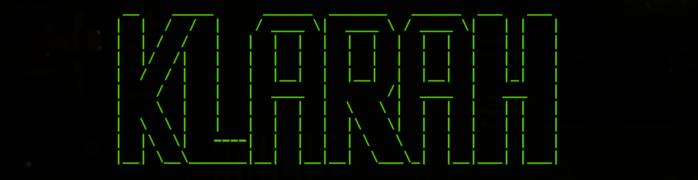

### A scaffolding tool for spinning up a quick Golang backend/API for your side projects.

Klarah is a great option to get an http server up and running quickly with little overhead. Let it take
care of the initial load of writing your own server from scratch. With many options of frameworks and
databases to choose from, you can customize it to fit your use case.

As stated in the prior paragraph, customization is a plus when using Klarah to start your project's backend.
Start with the boilerplate that is generated, add more or take away from what's there. The key is that you can
do as much or as little as you want once your project has been generated.

To install Klarah:
```
Install url goes here
```

When installed Klarah creates a binary that attaches directly to your GOPATH, so you can use it whenever you 
need to reach for it.

## Commands

Klarah has a make file that conveniently keeps all terminal commands organized and easy to use.

### General commands

When you want to start the server after configuration, simply run:
```
make run
'''

When needing to run the preset tests, or added tests in ./tests, run:
```
make test
```
## Database related commands

Klarah uses goose under the hood to run all your database migrations, after configuring your database connection,
to migrate your sql up to your databse run:
```
make up
``

If you need to reverse those migrations run:
```
make down
```

## Klarah's supported frameworks:
    - [Standard Library](https://pkg.go.dev/net/http#hdr-Servers)
    - [Echo](https://github.com/labstack/echo)
    - [Chi](https://github.com/go-chi/chi)
    - [Gin](https://github.com/gin-gonic/gin)

## Klarah's supported databases:
    - [Postgresql](https://github.com/jackc/pgx)
    - [Sqlite](https://github.com/mattn/go-sqlite3)
